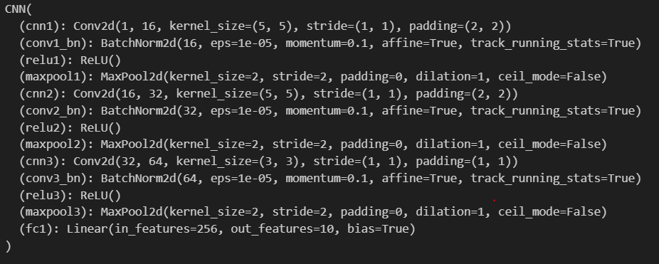
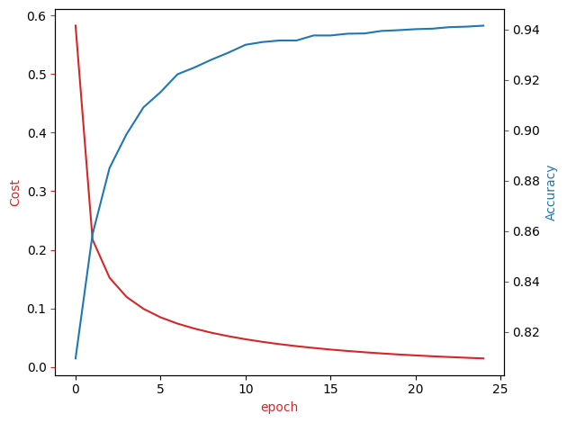

# KMNIST Image Classification using CNN

This project implements a Convolutional Neural Network (CNN) for classifying handwritten Japanese characters from the KMNIST dataset.The model is built using PyTorch and trained using a GPU on Google Colab for efficient performance.

## Model Architecture

## Training Cost and Validation Accuracy Progress

## Final Results
The model achieves a validation accuracy of 94.15% and training loss is 1.47%  after 25 epochs of training.
